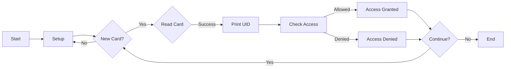

# RFID Access Control System

This code uses an Arduino board and an RFID reader (MFRC522) to control access to a certain area or device. The code reads the unique ID of an RFID tag and compares it to a pre-authorized tag. If the ID matches, access is granted and a green LED lights up. If the ID does not match, access is denied and the green LED remains off.

## Hardware
- Arduino board (e.g. Uno, Mega, Nano)
- MFRC522 RFID reader
- RFID tags
- Green LED
- 220 Ohm resistor (for LED)
- Jumper wires

## Pin connections

|MFRC522|Arduino|
|-------|-------|
|SDA    |10     |
|SCK    |13     |
|MOSI   |11     |
|MISO   |12     |
|IRQ    |not connected|
|GND    |GND    |
|RST    |9      |
|3.3V   |3.3V   |

|LED    |Arduino|
|-------|-------|
|Anode  |5      |
|Cathode|GND    |

## Setting up the code
1. Install the MFRC522 library in the Arduino IDE (Sketch > Include Library > MFRC522)
2. Connect the RFID reader and LED to the Arduino board according to the pin connections described above.
3. Upload the code to the Arduino board.
4. Open the serial monitor (Tools > Serial Monitor) and place an RFID tag on the reader. The tag's unique ID should be displayed in the serial monitor.
5. In the code, update the `content.substring(1) == "99 46 87 8D"` line with the UID of the RFID tag you want to give access.
6. Save the changes and upload the code to the Arduino board.

## Testing the code
1. Put the authorized RFID tag on the reader. The green LED should light up for a few seconds and the message "Authorized access" should be displayed in the serial monitor.
2. Put a non-authorized RFID tag on the reader. The green LED should not light up and the message "Access denied" should be displayed in the serial monitor.

## Note 
- You can add more RFID tags by adding more `else if` statements in the code and comparing their UIDs with the tag being read.
- The delay times for access granted and denied can be adjusted to your desired duration.
- The serial monitor is used only for debugging purposes and can be removed for final implementation.

## Flowchart 

