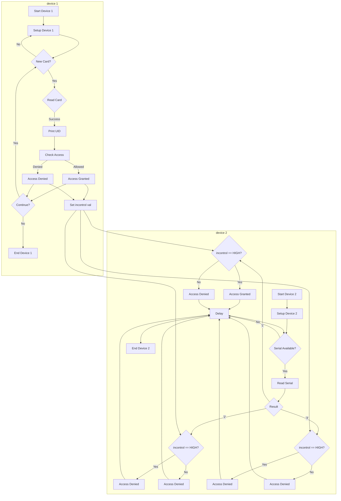

# RFID Access Control System with additional outputs

This code uses an Arduino board, an RFID reader (MFRC522), and several components (LEDs, a relay, and an input switch) to control access to a certain area or device. The code reads the unique ID of an RFID tag and compares it to a pre-authorized tag. If the ID matches, access is granted and a green LED lights up, the relay turns on and the blue LED turns on. If the ID does not match, access is denied and the green LED remains off, the relay remains off and the blue LED remains off. Additionally, the code also reads the state of an input switch. If the switch is high, access is granted and the LEDs and relay will turn on. If the switch is low, access is denied and the LEDs and relay will remain off. The access control can be triggered by sending commands through the serial monitor.

## Hardware

- Arduino board (e.g. Uno, Mega, Nano)
- MFRC522 RFID reader
- RFID tags
- Green LED
- Red LED
- Blue LED
- Relay
- Input switch
- Jumper wires

## Pin connections

|MFRC522|Arduino|
|-------|-------|
|SDA    |10     |
|SCK    |13     |
|MOSI   |11     |
|MISO   |12     |
|IRQ    |not connected|
|GND    |GND    |
|RST    |9      |
|3.3V   |3.3V   |

|LED    |Arduino|
|-------|-------|
|Green   |2      |
|Red |3      |
|Relay |4     |
|Input switch |5     |
|Blue |6      |

## Setting up the code

1. Install the MFRC522 library in the Arduino IDE (Sketch > Include Library > MFRC522)
2. Connect the RFID reader, LEDs, relay and input switch to the Arduino board according to the pin connections described above.
3. Upload the code to the Arduino board.
4. Open the serial monitor (Tools > Serial Monitor) and set it to "Newline" and "9600 baud"
5. Place an RFID tag on the reader, the tag's unique ID should be displayed in the serial monitor.
6. In the code, update the content.substring(1) == "99 46 87 8D" line with the UID of the RFID tag you want to give access.
7. Save the changes and upload the code to the Arduino board.
8. Send the command "1" to the serial monitor to trigger the access control.
9. Send the command "2" to the serial monitor to deny access.
10. Send the command "3" to the serial monitor to turn off all the outputs.

## Testing the code

1. Put the authorized RFID tag on the reader, the input switch is high, then send the command "1" to the serial monitor. The green LED should turn on, the red LED should turn off, the relay should turn on and the blue LED should turn on for 3.5 seconds.
2. Put the authorized RFID tag on the reader, the input switch is low, then send the command "1" to the serial monitor. The green LED should turn on, the red LED should turn on, the relay should turn off and the blue LED should turn off for 0.5 seconds.
3. Put a non-authorized RFID tag on the reader, the input switch is high, then send the command "1" to the serial monitor. The green LED should turn on, the red LED should turn on, the relay should turn off and the blue LED should turn off for 0.5 seconds.
4. Put a non-authorized RFID tag on the reader, the input switch is low, then send the command "1" to the serial monitor. The green LED should turn off, the red LED should turn on, the relay should turn off and the blue LED should turn off for 0.5 seconds.
5. Send the command "2" to the serial monitor. The green LED should turn off, the red LED should turn on, the relay should turn off and the blue LED should turn off for 0.5 seconds.
6. Send the command "3" to the serial monitor. All the outputs should turn off.

## Note

- You can add more RFID tags by adding more `else if` statements in the code and comparing their UIDs with the tag being read.
- The delay times for access granted and denied can be adjusted to your desired duration.
- The input switch can be replaced by any other input device that can be connected to the arduino like a button, a RFID reader, or a PIR sensor

## Additional use case

This project is just one of many examples of how we can apply the use of [google theachable machine](https://teachablemachine.withgoogle.com/). To use the project you can:

1. flash the arduino 1 with first program
2. flast the 2nd arduino with second program
3. connect the 2nd arduino to the pc/laptop
4. open [p5 serial control program](https://github.com/p5-serial/p5.serialcontrol/releases)
5. connect to arduino serial pin
6. open [p5.js web editor](https://editor.p5js.org/1999AZZAR/sketches/Te50F4Q3-)
7. edit the serial port in p5.js web editor so it's now same with in p5 serial control
8. run the p5.js web editor

## Flowchart

## Gallery

<!DOCTYPE html>
<html>
<!-- Image Grid Gallery -->

<!-- Image 1 -->

  

<!-- Image 2 -->

  

<!-- Image 3 -->

  

<!-- Image 4 -->

  

<!-- Image 5 -->

  

<!-- Image 6 -->

  

<!-- Image 7 -->

  

<!-- Image 8 -->

  

<!-- Image 9 -->

  

<!-- Image 10 -->

  

<!-- Image 11 -->

  

<!-- Image 12 -->

  

</html>
