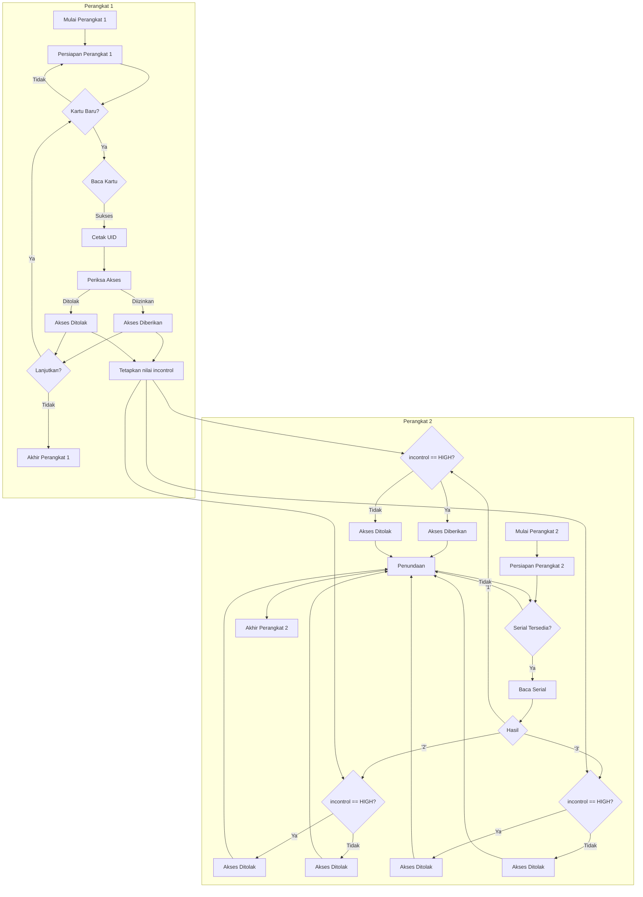

# Sistem Kontrol Akses RFID dengan Keluaran Tambahan

Kode ini menggunakan papan Arduino, pembaca RFID (MFRC522), dan beberapa komponen (LED, relay, dan sakelar input) untuk mengontrol akses ke area atau perangkat tertentu. Kode ini membaca ID unik dari tag RFID dan membandingkannya dengan tag yang telah diotorisasi sebelumnya. Jika ID cocok, akses diberikan dan LED hijau menyala, relay aktif, dan LED biru menyala. Jika ID tidak cocok, akses ditolak dan LED hijau tetap mati, relay tetap mati, dan LED biru tetap mati. Selain itu, kode ini juga membaca status sakelar input. Jika sakelar dalam posisi tinggi, akses diberikan dan LED serta relay akan menyala. Jika sakelar dalam posisi rendah, akses ditolak dan LED serta relay akan tetap mati. Kontrol akses dapat dipicu dengan mengirim perintah melalui serial monitor.

## Perangkat Keras

- Papan Arduino (misalnya Uno, Mega, Nano)
- Pembaca RFID MFRC522
- Tag RFID
- LED hijau
- LED merah
- LED biru
- Relay
- Sakelar input
- Kabel jumper

## Koneksi Pin

|MFRC522|Arduino|
|-------|-------|
|SDA    |10     |
|SCK    |13     |
|MOSI   |11     |
|MISO   |12     |
|IRQ    |tidak terhubung|
|GND    |GND    |
|RST    |9      |
|3.3V   |3.3V   |

|LED    |Arduino|
|-------|-------|
|Hijau  |2      |
|Merah  |3      |
|Relay  |4      |
|Sakelar input  |5      |
|Biru   |6      |

## Persiapan Kode

1. Pasang pustaka MFRC522 di Arduino IDE (Sketch > Include Library > MFRC522).
2. Sambungkan pembaca RFID, LED, relay, dan sakelar input ke papan Arduino sesuai dengan koneksi pin yang dijelaskan di atas.
3. Unggah kode ke papan Arduino.
4. Buka serial monitor (Tools > Serial Monitor) dan atur ke "Newline" dan "9600 baud".
5. Tempatkan tag RFID di atas pembaca, ID unik tag tersebut akan ditampilkan di serial monitor.
6. Di dalam kode, perbarui baris content.substring(1) == "99 46 87 8D" dengan UID tag RFID yang ingin diberi akses.
7. Simpan perubahan dan unggah ulang kode ke papan Arduino.
8. Kirim perintah "1" ke serial monitor untuk memicu kontrol akses.
9. Kirim perintah "2" ke serial monitor untuk menolak akses.
10. Kirim perintah "3" ke serial monitor untuk mematikan semua keluaran.

## Pengujian Kode

1. Letakkan tag RFID yang telah diotorisasi di atas pembaca, sakelar input berada dalam posisi tinggi, lalu kirim perintah "1" ke serial monitor. LED hijau harus menyala, LED merah harus mati, relay harus aktif, dan

 LED biru harus menyala selama 3,5 detik.
2. Letakkan tag RFID yang telah diotorisasi di atas pembaca, sakelar input berada dalam posisi rendah, lalu kirim perintah "1" ke serial monitor. LED hijau harus menyala, LED merah harus menyala, relay harus mati, dan LED biru harus mati selama 0,5 detik.
3. Letakkan tag RFID yang tidak diotorisasi di atas pembaca, sakelar input berada dalam posisi tinggi, lalu kirim perintah "1" ke serial monitor. LED hijau harus menyala, LED merah harus menyala, relay harus mati, dan LED biru harus mati selama 0,5 detik.
4. Letakkan tag RFID yang tidak diotorisasi di atas pembaca, sakelar input berada dalam posisi rendah, lalu kirim perintah "1" ke serial monitor. LED hijau harus mati, LED merah harus menyala, relay harus mati, dan LED biru harus mati selama 0,5 detik.
5. Kirim perintah "2" ke serial monitor. LED hijau harus mati, LED merah harus menyala, relay harus mati, dan LED biru harus mati selama 0,5 detik.
6. Kirim perintah "3" ke serial monitor. Semua keluaran harus mati.

## Catatan

- Anda dapat menambahkan lebih banyak tag RFID dengan menambahkan pernyataan `else if` dalam kode dan membandingkan UID mereka dengan tag yang dibaca.
- Waktu jeda untuk akses yang diizinkan dan ditolak dapat disesuaikan sesuai dengan durasi yang diinginkan.
- Sakelar input dapat digantikan dengan perangkat masukan lain yang dapat dihubungkan ke Arduino seperti tombol, pembaca RFID, atau sensor PIR.

## Penggunaan Tambahan

Proyek ini hanya salah satu contoh dari banyaknya penerapan [google theachable machine](https://teachablemachine.withgoogle.com/). Untuk menggunakan proyek ini, Anda dapat:

1. Mem-flash arduino 1 dengan program pertama.
2. Mem-flash arduino 2 dengan program kedua.
3. Menghubungkan arduino 2 ke PC/laptop.
4. Membuka [program p5 serial control](https://github.com/p5-serial/p5.serialcontrol/releases).
5. Menghubungkan ke pin serial arduino.
6. Membuka [p5.js web editor](https://editor.p5js.org/1999AZZAR/sketches/Te50F4Q3-).
7. Mengedit port serial dalam p5.js web editor agar sama dengan dalam p5 serial control.
8. Menjalankan p5.js web editor.

## Diagram Alir

## Galeri

<!DOCTYPE html>
<html>
<!-- Image Grid Gallery -->

<!-- Image 1 -->

  

<!-- Image 2 -->

  

<!-- Image 3 -->

  

<!-- Image 4 -->

  

<!-- Image 5 -->

  

<!-- Image 6 -->

  

<!-- Image 7 -->

  

<!-- Image 8 -->

  

<!-- Image 9 -->

  

<!-- Image 10 -->

  

<!-- Image 11 -->

  

<!-- Image 12 -->

  

</html>
