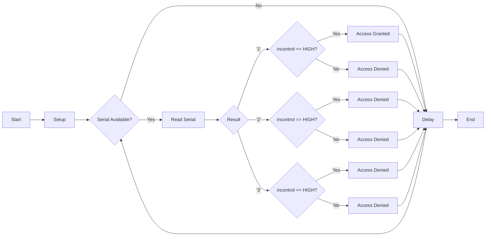

# Access Control System

This code uses an Arduino board and several components (LEDs, a relay, and an input switch) to control access to a certain area or device. The code reads the state of an input switch, if the switch is high, access is granted and the LEDs and relay will turn on. If the switch is low, access is denied and the LEDs and relay will remain off. The access control can be triggered by sending commands through the serial monitor.

## Hardware
- Arduino board (e.g. Uno, Mega, Nano)
- Green LED
- Red LED
- Blue LED
- Relay
- Input switch
- Jumper wires

## Pin connections

|Component|Arduino|
|-------|-------|
|Green LED    |2     |
|Red LED    |3     |
|Relay    |4     |
|Input switch  |5     |
|Blue LED   |6     |

## Setting up the code
1. Connect the LEDs, relay and the input switch to the Arduino board according to the pin connections described above.
2. Upload the code to the Arduino board.
3. Open the serial monitor (Tools > Serial Monitor) and set it to "Newline" and "9600 baud"
4. Send the command "1" to the serial monitor to trigger the access control.
5. Send the command "2" to the serial monitor to deny access.
6. Send the command "3" to the serial monitor to turn off all the outputs.

## Testing the code
1. Set the input switch to high, then send the command "1" to the serial monitor. The green LED should turn on, the red LED should turn off, the relay should turn on and the blue LED should turn on for 3.5 seconds.
2. Set the input switch to low, then send the command "1" to the serial monitor. The green LED should turn on, the red LED should turn on, the relay should turn off and the blue LED should turn off for 0.5 seconds.
3. Send the command "2" to the serial monitor. The green LED should turn off, the red LED should turn on, the relay should turn off and the blue LED should turn off for 0.5 seconds.
4. Send the command "3" to the serial monitor. All the outputs should turn off.

## Note 
- The delay times for access granted and denied can be adjusted to your desired duration.
- The input switch can be replaced by any other input device that can be connected to the arduino like a button, a RFID reader, or a PIR sensor

## Flowchart 

